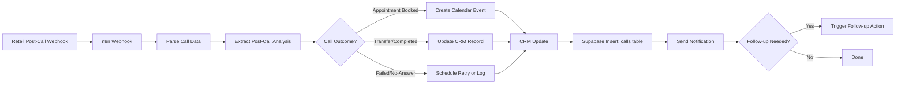

# Post-Call Reporting -- n8n Architecture Guide

**Use Case:** {{use_case}} (Inbound Receptionist, Speed-to-Lead, Database Reactivation)
**Client:** {{client_name}}
**Voice Platform:** {{voice_platform}} (Retell recommended)
**CRM:** {{crm_system}}
**Date:** {{date}}

---

## Overview

Post-call reporting is the "after the agent talks" layer. It receives call completion data from Retell (via webhook), extracts structured information from the transcript and post-call analysis, updates the CRM with call outcomes, sends notifications to stakeholders, and logs everything to Supabase for dashboard reporting.

This is where the voice agent's value becomes visible to your client. Without post-call reporting, the agent makes calls but nobody sees what happened. With it, every call turns into a CRM update, a Slack notification, and a dashboard data point.

This guide covers architecture and data flow rather than specific node setup. Refer to n8n's node documentation for configuration details, as these change across versions.

---

## Prerequisites

Before building post-call reporting, you need:

- **n8n installed** (self-hosted or cloud) -- [n8n hosting docs](https://docs.n8n.io/hosting/)
- **Retell API key** -- [Retell dashboard](https://www.retell.ai/dashboard)
- **Retell webhook configured** -- Post-call webhook URL pointing to your n8n webhook endpoint
- **CRM API access** for {{crm_system}} -- credentials with read/write permissions
- **Supabase project** with base schema (leads, deals, clients tables) plus extension tables (calls, agent_configs)
- **Schema reference:** `templates/systems/_shared/supabase-schema-extension.sql`
- **n8n basics** -- you know what a Webhook node is and have connected an HTTP Request node before

**New to n8n?** Start here: [n8n Getting Started Guide](https://docs.n8n.io/getting-started/). Build one or two simple workflows before tackling post-call reporting.

---

## Architecture Diagram

The flow starts with Retell's post-call webhook and fans out into outcome-specific actions. Every path converges at CRM update and Supabase logging before notifications go out.

---

## Retell Webhook Payload

When a call ends, Retell sends a webhook payload containing the call data. Key fields you will work with:

| Field | Description |
| ----- | ----------- |
| `call_id` | Unique identifier for the call in Retell |
| `agent_id` | Which Retell agent handled the call |
| `call_type` | `inbound` or `outbound` |
| `from_number` / `to_number` | Phone numbers involved |
| `duration_ms` | Call duration in milliseconds |
| `recording_url` | Signed URL to the call recording |
| `transcript` | Full conversation transcript |
| `call_analysis` | Structured data extracted by Retell's post-call analysis |
| `call_status` | Final status of the call |
| `disconnection_reason` | Why the call ended (caller hangup, agent hangup, error, etc.) |

The `call_analysis` object contains the custom fields you define in your Retell agent configuration -- for example, `caller_name`, `outcome`, `appointment_date`, `sentiment`. These vary by agent setup.

> **Note:** Exact field names may vary by Retell API version. Reference the [Retell API docs](https://docs.retell.ai/) for the current webhook schema.

---

## Decision Points

Before building, work through these decisions with your client:

1. **Which post-call analysis fields to extract?** This depends on the use case. Inbound receptionist: caller name, reason for calling, appointment booked. Speed-to-Lead: interest level, callback requested. DBR: offer accepted, appointment booked.
2. **What CRM actions on each outcome?** Appointment booked = create calendar event + update CRM stage. Failed = flag for retry. Voicemail = schedule callback. Map every outcome to a specific action.
3. **Who gets notified and how?** Client gets a Slack message for every booked appointment? Agency operator gets an email for failed calls? Define the notification matrix.
4. **What data goes to Supabase?** All calls (including failed/no-answer) or only completed calls? Logging everything gives better analytics. Failed calls reveal patterns too.
5. **Follow-up triggers:** When should n8n initiate a follow-up action? Missed call = retry in 30 minutes? Voicemail = send SMS? Define the rules.

---

## Component Breakdown

Each component below describes WHAT it does and WHICH n8n node type to use. Refer to n8n's node documentation for specific configuration.

### Webhook Receiver

- **What it does:** Receives the Retell post-call webhook payload when a call ends. Parses the JSON body and passes it to the next node.
- **Node type:** Webhook
- **Key tip:** Retell sends the webhook immediately after the call ends. Your n8n workflow must be active (not in test mode) to receive production webhooks. Use test mode with sample payloads during development.

### Data Parser

- **What it does:** Extracts and structures the relevant fields from the raw Retell payload. Normalizes data formats (e.g., duration from milliseconds to seconds, phone number formatting).
- **Node type:** Code (JavaScript)
- **Key tip:** Keep the Code node focused on data extraction only. Do not put business logic here. Extract fields, normalize formats, pass structured data to the next node.

### Outcome Router

- **What it does:** Routes the call to different processing paths based on the call outcome (appointment-booked, transferred, voicemail, no-answer, completed, failed).
- **Node type:** Switch
- **Key tip:** Map your Retell post-call analysis `outcome` values to the Switch node cases. Make sure every possible outcome has a path -- including an "unknown" default case that logs and notifies.

### CRM Updater

- **What it does:** Creates or updates the contact/lead record in the client's CRM with call outcome, notes, and next steps.
- **Node type:** HTTP Request
- **Key tip:** Always include the call date, duration, and outcome in the CRM update. If the call resulted in an appointment, include the appointment date/time. Your client's team needs this information to prepare.

### Calendar Creator

- **What it does:** Creates a calendar event when an appointment is booked during the call. Sends confirmation to the relevant staff.
- **Node type:** HTTP Request (Google Calendar API, Calendly API, or CRM's built-in calendar)
- **Key tip:** Include the caller's name, phone number, and reason for the appointment in the calendar event description. The staff member needs context when the appointment arrives.

### Supabase Logger

- **What it does:** Inserts a row into the `calls` table in Supabase, capturing call metadata for dashboard reporting.
- **Node type:** HTTP Request (Supabase REST API)
- **Key tip:** Use the Supabase REST API endpoint: `POST https://{project}.supabase.co/rest/v1/calls`. Include the `apikey` and `Authorization` headers. See the Supabase Integration section below for field mapping.

### Notification Sender

- **What it does:** Sends a call summary notification to the client or agency operator via Slack, email, or SMS.
- **Node type:** Slack node, Email node, or HTTP Request (for SMS APIs)
- **Key tip:** Format the notification for quick scanning. Include: caller name, outcome, duration, and any action items. Avoid sending the full transcript -- link to the recording instead.

### Follow-up Trigger

- **What it does:** Schedules or initiates follow-up actions based on the call outcome (retry call, send SMS, send email with requested information).
- **Node type:** Wait node (for delays) or HTTP Request (for immediate actions)
- **Key tip:** For retry logic, use n8n's Wait node to delay before calling the pre-call automation webhook to re-trigger the call. This creates a clean separation between post-call and pre-call workflows. See also: [Pre-Call Automation](pre-call-automation.md).

---

## Supabase Integration

Post-call reporting writes to the `calls` table defined in the schema extension. Reference: `templates/systems/_shared/supabase-schema-extension.sql`

### Field Mapping

How Retell webhook data maps to the Supabase `calls` table columns:

| Retell Field | Supabase Column | Notes |
| ------------ | --------------- | ----- |
| *(generate UUID)* | `id` | Supabase generates the UUID automatically |
| *(lookup by client)* | `client_id` | Look up the client UUID from the `clients` table |
| `agent_id` | `agent_config_id` | Look up by `client_id` + `use_case` in `agent_configs` table |
| `call_type` | `call_type` | `'inbound'` or `'outbound'` |
| `from_number` | `caller_number` | The caller's phone number |
| `duration_ms / 1000` | `duration_seconds` | Convert milliseconds to seconds |
| `call_analysis.outcome` | `outcome` | Map to enum: `appointment-booked`, `transferred`, `voicemail`, `no-answer`, `completed`, `failed` |
| `recording_url` | `recording_url` | Signed URL from Retell (may expire) |
| `transcript` or URL | `transcript_url` | Store transcript URL or reference |
| *(set after CRM update)* | `crm_synced` | Set to `true` after successful CRM update |

### Dual-Write Pattern

The data architecture follows a dual-write pattern established in Phase 3:

- **Markdown files** remain the source of truth for client context, meeting notes, commitments, and qualitative information
- **Supabase** provides the quantitative reporting layer -- call volumes, conversion rates, duration trends
- **n8n writes to Supabase** on every call completion
- **The dashboard reads from Supabase** to display charts, metrics, and client health indicators

This means call data lives in two places: the client's markdown file (updated by the `/follow-up` skill with qualitative notes) and the Supabase `calls` table (updated automatically by n8n with quantitative data). They serve different purposes and do not need to stay in sync.

---

## n8n vs Code Decision Matrix

As your agency grows, some automations may outgrow n8n. Use this matrix to decide when to keep using n8n and when to move logic into deployed code (on Render, Railway, or similar).

| Scenario | n8n | Code (Render/Railway) | Recommendation |
| -------- | --- | --------------------- | -------------- |
| Simple webhook to CRM to call | Yes | Overkill | **n8n** |
| Complex CRM logic (conditional updates, multi-object) | Possible but brittle | Yes | **Code** |
| High volume (100+ calls/day) | May hit execution limits | Yes | **Code** |
| Custom API endpoints for client apps | Not ideal | Yes | **Code** |
| Quick prototyping and testing | Yes | Slower setup | **n8n** |
| Multi-step data transformation | Possible | Cleaner and testable | **Depends on complexity** |

### Graduation Path

1. **Start with n8n** -- Build everything in n8n workflows. Great for your first 1-5 clients. Fast to build, easy to debug visually, quick to iterate.
2. **Hybrid** -- n8n handles webhook routing and simple logic. Code on Render/Railway handles complex CRM integrations, multi-step data processing, and anything that needs unit tests. Good for 5-15 clients.
3. **Code-first** -- n8n only for simple webhook routing and triggering. All business logic lives in deployed code with proper error handling, logging, and monitoring. For 15+ clients or complex integrations where reliability is critical.

**When to graduate:** If you find yourself using n8n's Code node for more than 20 lines of JavaScript, or if you are debugging the same workflow failure for the third time, it is time to move that logic into deployed code.

---

## n8n MCP Setup (Optional)

You can connect n8n to Claude Code via MCP (Model Context Protocol) for local development assistance.

> **Disclaimer:** Verify these steps against the latest n8n MCP documentation before following. MCP tooling is evolving rapidly.

- **Install:** `npm install -g @anthropic-ai/mcp-server-n8n` (or check n8n's official MCP package name)
- **Configure:** Add the MCP server to your Claude Code MCP settings file
- **Use for:** Testing webhook payloads, debugging workflow logic, inspecting execution history, generating n8n workflow configurations

This is optional and primarily useful during development and debugging. Your production n8n workflows run independently of Claude Code.

---

## Video Walkthrough

Video walkthrough coming soon. In the meantime, these resources cover the key concepts:

- Retell webhook setup: [link placeholder]
- n8n post-call processing patterns: [link placeholder]
- Supabase integration from n8n: [link placeholder]
- Post-call reporting end-to-end demo: [link placeholder]

---

## Testing Approach

Before going live with any post-call reporting workflow:

1. **Send test webhook payloads** -- Use curl to send mock Retell post-call payloads to your n8n webhook. Start with a sample payload from the Retell docs.
2. **Verify data extraction** -- Confirm the Data Parser node correctly extracts call analysis fields from the sample payload.
3. **Verify outcome routing** -- Send payloads with different outcomes (appointment-booked, failed, voicemail) and confirm each routes correctly.
4. **Verify CRM updates** -- Check that CRM records are created or updated with the correct call data after each test.
5. **Verify Supabase insert** -- Query the `calls` table after each test to confirm the row was inserted with correct field values.
6. **Verify notifications** -- Confirm Slack messages or emails arrive with the expected formatting and content.
7. **End-to-end test** -- Make a real test call through the Retell agent, let it complete, and verify the full pipeline fires: webhook received, CRM updated, Supabase row inserted, notification sent.
8. **Test error paths** -- Send a malformed payload, simulate a CRM timeout, and trigger a Supabase insert failure. Verify error notifications fire.

**Key validation:** After an end-to-end test, check three places: the CRM record, the Supabase `calls` table, and the notification channel. All three should reflect the same call.

---

*Template: Post-Call Reporting Architecture Guide*
*Part of: Agency Ops Hub -- Delivery Templates*
*See also: [Pre-Call Automation](pre-call-automation.md)*
