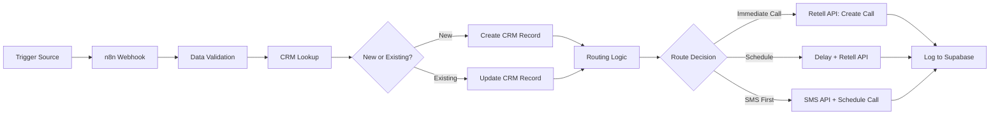

# Pre-Call Automation -- n8n Architecture Guide

**Use Case:** {{use_case}} (Speed-to-Lead, Scheduled Callbacks, Lead Routing)
**Client:** {{client_name}}
**Voice Platform:** {{voice_platform}} (Retell recommended)
**CRM:** {{crm_system}}
**Date:** {{date}}

---

## Overview

Pre-call automation is the "before the agent talks" layer. It receives a trigger -- a form submission, a missed call, a scheduled event -- processes the incoming data, enriches the lead with CRM context, and initiates the voice agent call with the right information attached.

This guide covers the high-level architecture and key decision points for building pre-call automations in n8n. It focuses on architecture and data flow rather than specific node setup (n8n versions change frequently). The goal is to help you think architecturally so you can build and adapt workflows confidently.

**When you need this:** Any time a voice agent needs to be triggered by an external event rather than receiving a direct phone call.

---

## Prerequisites

Before building pre-call automations, you need:

- **n8n installed** (self-hosted or cloud) -- [n8n hosting docs](https://docs.n8n.io/hosting/)
- **Retell API key** -- [Retell dashboard](https://www.retell.ai/dashboard)
- **CRM API access** for {{crm_system}} -- credentials with read/write permissions
- **n8n basics** -- you know what a Webhook node is and have connected an HTTP Request node before

**New to n8n?** Start here: [n8n Getting Started Guide](https://docs.n8n.io/getting-started/). Build one or two simple workflows before tackling pre-call automation.

---

## Architecture Diagram

The flow is linear: trigger comes in, data gets validated and enriched, a routing decision is made, the call is initiated, and the event is logged. Every step has a clear input and output.

---

## Trigger Types

Common trigger sources and how they connect to n8n:

| Trigger | n8n Node Type | Setup Notes |
|---------|--------------|-------------|
| Website form | Webhook | Form action URL points to n8n webhook endpoint |
| Google Ads lead form | Webhook via Zapier or direct | Google Ads sends lead data to n8n webhook |
| Facebook Lead Ads | Webhook via Zapier or direct | Facebook sends lead data to n8n webhook |
| Missed call | Webhook from phone provider | Phone system fires webhook on missed call event |
| Scheduled event | Cron trigger | n8n Schedule node runs at set intervals |
| CRM status change | Webhook from CRM | CRM fires webhook when record status changes |
| Manual trigger | n8n Manual Trigger | For testing and one-off calls |

**Tip:** Most triggers arrive as webhooks. If the source system does not support webhooks natively, use Zapier or Make as a bridge to forward the event to your n8n webhook URL.

---

## Decision Points

Before building, work through these decisions with your client:

1. **What triggers the call?** Form submission, missed call, schedule, CRM event? This determines your entry node.
2. **Should leads be enriched before calling?** CRM lookup, data append, duplicate check? More enrichment = more latency before the call fires.
3. **What routing logic applies?** Time of day, lead source, geographic location, lead score? Keep routing simple at first -- you can add complexity later.
4. **Immediate call or delayed?** Speed-to-Lead demands immediate (<60 seconds). Database Reactivation calls are batched. Match the use case.
5. **SMS before or after the call?** Some flows send a "heads up" SMS before the agent calls. Others use SMS as a fallback when the call goes unanswered.
6. **Error handling: retry or notify?** If the Retell API call fails, should n8n retry automatically, or just notify you? For production, do both: retry once, then notify on second failure.

---

## Component Breakdown

Each component below describes WHAT it does and WHICH n8n node type to use. Refer to n8n's node documentation for specific configuration.

### Webhook Receiver
- **What it does:** Listens for incoming HTTP requests from trigger sources. Parses the JSON payload and passes it to the next node.
- **Node type:** Webhook
- **Key tip:** Use the "Test URL" during development to inspect payloads, then switch to the "Production URL" when activating the workflow.

### Data Validator
- **What it does:** Checks that required fields are present in the payload (phone number, name, lead source). Routes invalid payloads to an error handler.
- **Node type:** IF or Switch
- **Key tip:** Always validate the phone number format. A missing or malformed number will cause the Retell API call to fail silently.

### CRM Lookup
- **What it does:** Queries your client's CRM to check if this lead already exists. Returns existing record data or indicates "new lead."
- **Node type:** HTTP Request
- **Key tip:** Use the CRM's search/filter API endpoint, not a "get by ID" endpoint. You are searching by phone number or email, not by a known record ID.

### Record Creator/Updater
- **What it does:** Creates a new CRM record for new leads or updates an existing record with the latest interaction data.
- **Node type:** HTTP Request
- **Key tip:** Most CRMs have separate endpoints for create vs. update. Some (like GoHighLevel) have an upsert endpoint that handles both.

### Routing Logic
- **What it does:** Determines how and when to initiate the call based on business rules (time of day, lead source, priority level).
- **Node type:** IF or Switch
- **Key tip:** Start with a simple IF node (one condition). Only upgrade to a Switch node when you have three or more routing paths.

### Voice Agent Trigger
- **What it does:** Calls the Retell Create Phone Call API to initiate an outbound call with the enriched lead context.
- **Node type:** HTTP Request
- **Key tip:** The Retell Create Call API requires `agent_id` and `to_number` in the request body. Pass any custom data (caller name, CRM record ID) via `metadata` or `retell_llm_dynamic_variables` so the agent has context during the call.

### Error Handler
- **What it does:** Catches failures from any node in the workflow. Sends a notification (Slack, email) with error details so you can investigate.
- **Node type:** Error Trigger
- **Key tip:** n8n's Error Trigger fires for ANY workflow error. Add context (which lead, which step failed) to your error notification so debugging is fast.

### Logger
- **What it does:** Writes a record of the trigger event and call initiation to Supabase for dashboard tracking and audit trail.
- **Node type:** HTTP Request (Supabase REST API)
- **Key tip:** Log both successful calls AND failed attempts. You want to know how many triggers came in vs. how many calls were actually placed.

---

## n8n vs Code Decision Matrix

As your agency grows, some automations may outgrow n8n. Use this matrix to decide when to keep using n8n and when to move logic into deployed code (on Render, Railway, or similar).

| Scenario | n8n | Code (Render/Railway) | Recommendation |
|----------|-----|----------------------|----------------|
| Simple webhook to CRM to call | Yes | Overkill | **n8n** |
| Complex CRM logic (conditional updates, multi-object) | Possible but brittle | Yes | **Code** |
| High volume (100+ calls/day) | May hit execution limits | Yes | **Code** |
| Custom API endpoints for client apps | Not ideal | Yes | **Code** |
| Quick prototyping and testing | Yes | Slower setup | **n8n** |
| Multi-step data transformation | Possible | Cleaner and testable | **Depends on complexity** |

### Graduation Path

1. **Start with n8n** -- Build everything in n8n workflows. Great for your first 1-5 clients. Fast to build, easy to debug visually, quick to iterate.
2. **Hybrid** -- n8n handles webhook routing and simple logic. Code on Render/Railway handles complex CRM integrations, multi-step data processing, and anything that needs unit tests. Good for 5-15 clients.
3. **Code-first** -- n8n only for simple webhook routing and triggering. All business logic lives in deployed code with proper error handling, logging, and monitoring. For 15+ clients or complex integrations where reliability is critical.

**When to graduate:** If you find yourself using n8n's Code node for more than 20 lines of JavaScript, or if you are debugging the same workflow failure for the third time, it is time to move that logic into deployed code.

---

## n8n MCP Setup (Optional)

You can connect n8n to Claude Code via MCP (Model Context Protocol) for local development assistance.

> **Disclaimer:** Verify these steps against the latest n8n MCP documentation before following. MCP tooling is evolving rapidly.

- **Install:** `npm install -g @anthropic-ai/mcp-server-n8n` (or check n8n's official MCP package name)
- **Configure:** Add the MCP server to your Claude Code MCP settings file
- **Use for:** Testing webhook payloads, debugging workflow logic, inspecting execution history, generating n8n workflow configurations

This is optional and primarily useful during development and debugging. Your production n8n workflows run independently of Claude Code.

---

## Video Walkthrough

Video walkthrough coming soon. In the meantime, these resources cover the key concepts:

- n8n Webhook basics: [link placeholder]
- Retell API integration patterns: [link placeholder]
- CRM webhook patterns: [link placeholder]
- Pre-call automation end-to-end demo: [link placeholder]

---

## Testing Approach

Before going live with any pre-call automation:

1. **Test webhook receipt** -- Send test payloads using n8n's built-in test mode or curl. Verify the payload is parsed correctly.
2. **Verify CRM lookup** -- Confirm the lookup returns correct data for known records and handles "not found" gracefully.
3. **Verify Retell API call** -- Confirm the call is initiated with the correct agent_id, to_number, and metadata. Check the Retell dashboard to see the call appear.
4. **Test error paths** -- Send a malformed payload (missing phone number), simulate a CRM timeout, and trigger a Retell API error. Verify error notifications fire.
5. **Verify Supabase logging** -- Query the Supabase table after each test to confirm events are recorded.
6. **End-to-end test** -- Submit a real form (or trigger a real event), verify the call is initiated within the target latency, and confirm CRM and Supabase records are created.
7. **Load test (if high volume)** -- If the client expects 50+ triggers per day, send a burst of test webhooks and verify n8n handles them without dropping any.

**Target latency:** For Speed-to-Lead, the call should initiate within 60 seconds of the form submission. Measure this end-to-end during testing.

---

*Template: Pre-Call Automation Architecture Guide*
*Part of: Agency Ops Hub -- Delivery Templates*
*See also: [Post-Call Reporting](post-call-reporting.md)*
